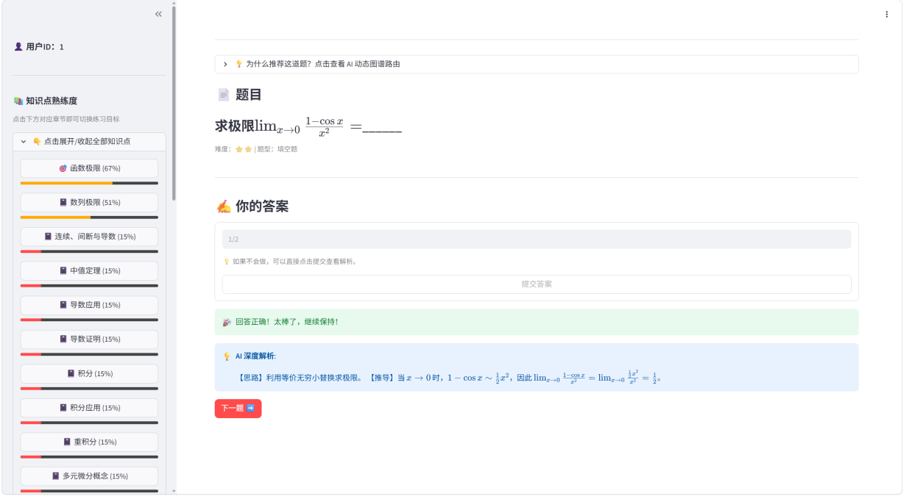
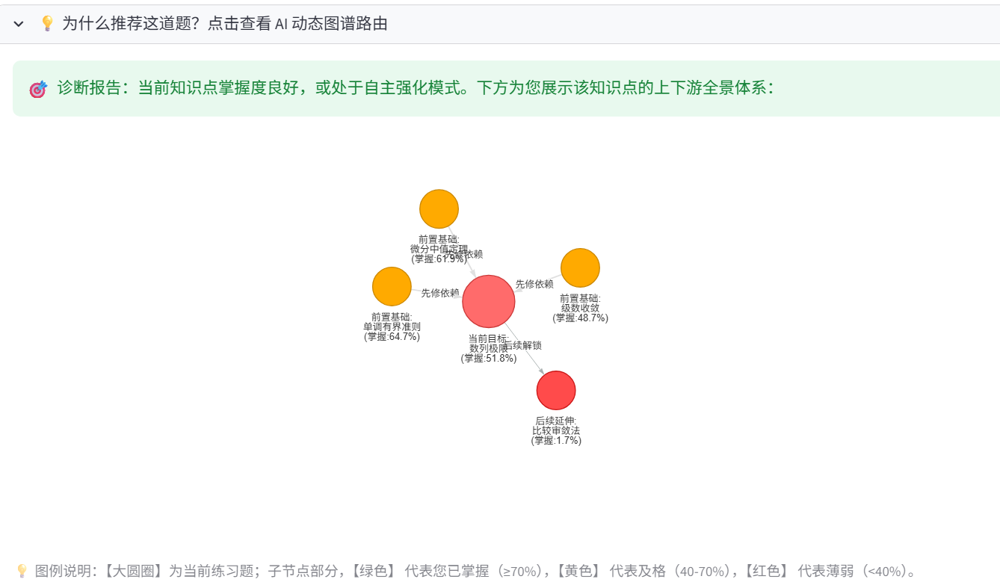
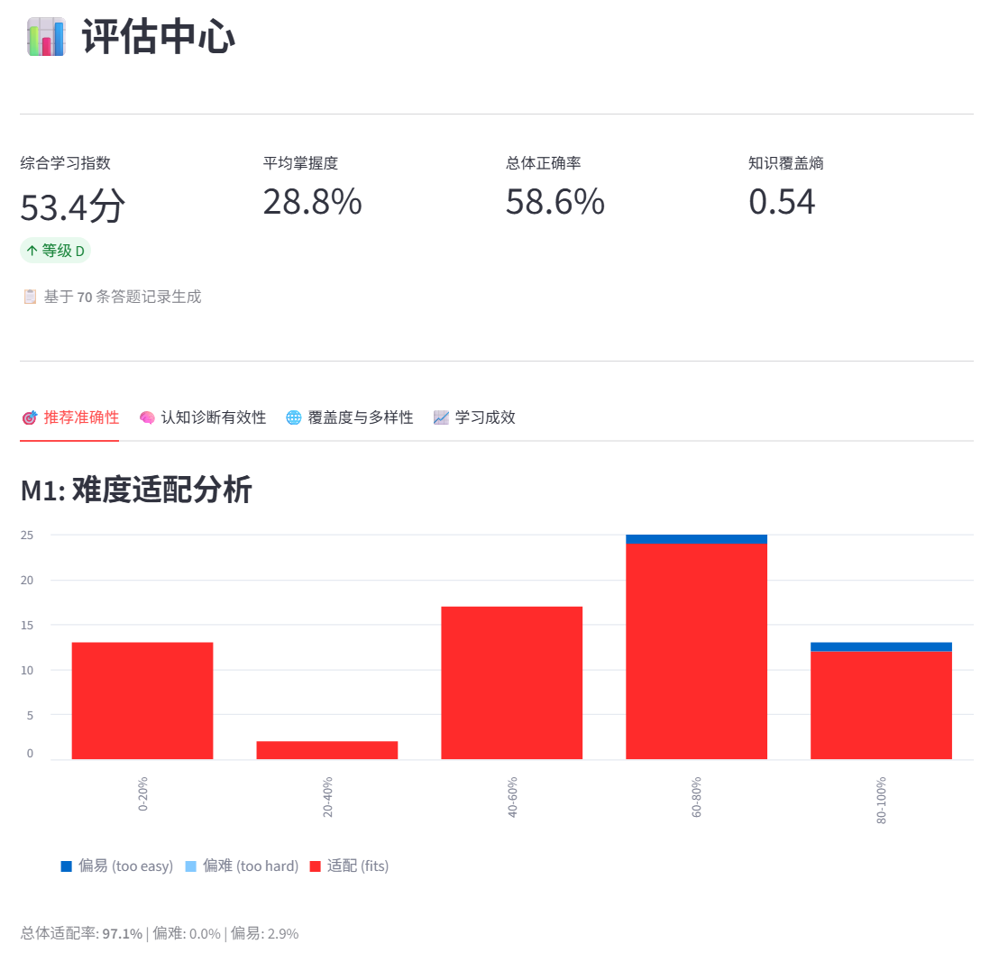
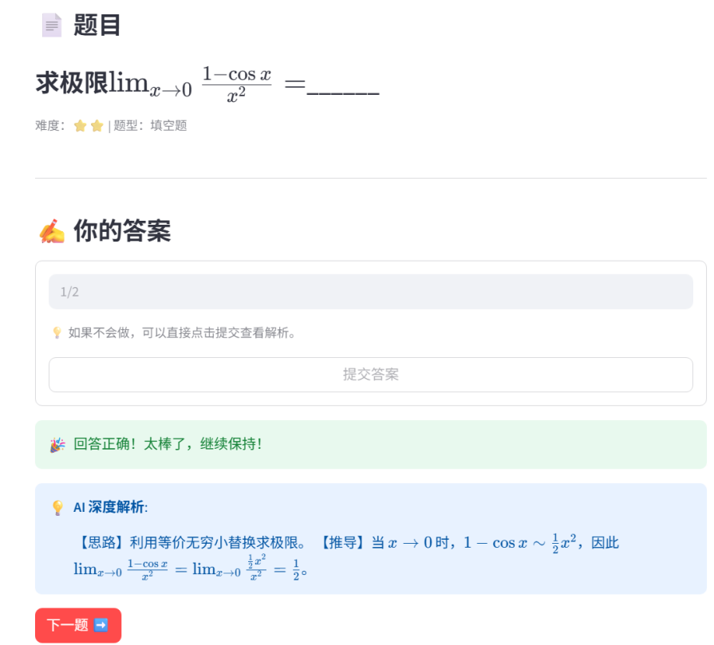
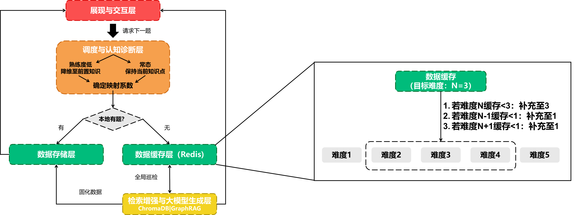

# 基于 BKT 用户画像建模与知识图谱驱动的数学推题系统

## 项目简介

本项目是一个面向考研高等数学的**自适应教育推荐系统**。与传统协同过滤"投其所好"的思路不同，本系统目标在于**查漏补缺**：通过贝叶斯知识追踪（BKT）实时建模学生对各知识点的掌握状态，并利用知识图谱的拓扑结构进行智能路由，动态分发处于学生"最近发展区"的练习题。

## 核心特性

### 1. BKT 动态用户画像

- 基于贝叶斯推断，根据答题正误实时更新学生对每个知识点的掌握概率
- **知识图谱传播机制**：答对题目不仅提升当前知识点，还会正向传播增强前置基础节点；答错则反向削弱依赖该知识的后继节点
- 掌握度以百分比形式可视化，红/黄/绿三色标识强弱项

### 2. 知识图谱注意力路由

- 构建考研高数 16 个知识点的有向依赖图（NetworkX 有向图 + PageRank）
- **Dynamic Attention Routing**：当检测到学生基础薄弱时（掌握度 < 30%），自动沿图谱 BFS 搜索前置知识点，通过注意力分数（语义相似度 × 结构权重 × 距离衰减 + PageRank × 3.0 - 掌握度 × 1.5）选取最佳降维路径
- 可视化路由过程与局部图谱拓扑

### 3. 五层降级推荐策略
```
图谱路由 → 本地 SQLite 题库 → Redis 缓存池 → 相邻难度借用 → LLM 实时生成
```
确保在缓存为空、题库枯竭或 LLM 不可用的各种场景下系统仍能稳定出题。

### 4. LLM 生成式推荐 + RAG
- 结合 ChromaDB 向量知识库（GTE-Qwen2 嵌入），从考研真题语料中检索相关上下文
- 调用 DeepSeek API 实时生成结构化数学题目（题干、选项、答案、思维链解析）
- Redis 异步缓存池：后台线程预生成题目，分布式锁防止并发重复生成

### 5. 多维评估体系

8 项指标综合评估推荐质量：
| 指标 | 说明 |
|------|------|
| M1 难度适配准确率 | 推荐难度与用户掌握度匹配度 |
| M3 掌握度-正确率一致性 | BKT 分数的预测有效性（Pearson 相关） |
| M4 知识点掌握雷达图 | 16 个知识点的掌握度可视化 |
| M5 知识点覆盖均衡度 | 已练习知识点的多样性（归一化熵） |
| M6 难度分布合理性 | 答题历史的难度分布 |
| M7 正确率时间趋势 | 带线性回归的滑动窗口趋势 |
| M8 综合学习指数 | 加权综合评分（A-E 等级） |

### 6. SymPy 数学判题

- 基于符号计算的答案判定（`sympy.simplify(expr1 - expr2) == 0`）
- 支持分数、负号等数学表达式的等价判断

## 系统架构



## 技术栈

| 层级 | 技术 |
|------|------|
| 前端 | Streamlit, streamlit-agraph (交互式图谱) |
| 推荐算法 | BKT 变体, PageRank, BFS 注意力路由 |
| 知识图谱 | NetworkX (有向图), 节点嵌入 (GTE-Qwen2) |
| 向量数据库 | ChromaDB |
| 缓存 | Redis (异步题目缓冲池) |
| 数据库 | SQLite |
| 数学判题 | SymPy (符号计算) |
| LLM | DeepSeek V4 Flash (出题), 智谱 GLM-4V/GLM-5.1 (数据预处理) |
| 嵌入模型 | GTE-Qwen2-1.5B-instruct (SentenceTransformer) |
| 数据处理 | PyMuPDF, Pandas, NumPy |
| 评估 | Matplotlib (雷达图), SciPy (Pearson 相关) |

## 快速开始

### 环境要求
- Python >= 3.10
- Redis (可选，用于题目缓存池；未安装时系统自动回退至 LLM 直接生成)

### 安装

```bash
# 克隆仓库
git clone https://github.com/Whitewater8512/MathPracticeRecommender.git
cd MathPracticeRecommender

# 安装依赖
pip install -r requirements.txt
```

### 配置

编辑项目根目录下的 `.env` 文件，填入 DeepSeek API 密钥：

```
DEEPSEEK_API_KEY=your-api-key-here
```

### 运行

```bash
streamlit run app.py --server.port 6006
```

启动后浏览器访问 `http://localhost:6006` 即可使用。

## 项目结构

```
.
├── app.py                          # Streamlit 前端主入口
├── database.py                     # SQLite 数据库层 (用户/题库/答题记录)
├── rec_model.py                    # 推荐引擎 (五层降级策略 + Redis 缓存池)
├── graph_rag.py                    # 知识图谱引擎 (构建/路由/可视化)
├── graph_kt.py                     # 认知诊断 (BKT 掌握度传播)
├── rag.py                          # 向量知识库 (ChromaDB + 嵌入)
├── llm_api.py                      # LLM 出题接口 (DeepSeek)
├── evaluation.py                   # 评估框架 (8 指标 + 雷达图)
├── data_pipeline.py                # 数据预处理流水线 (PDF → Markdown → 分块 → KG)
├── requirements.txt                # Python 依赖
├── .env                            # API 密钥配置
├── mpr.db                          # SQLite 数据库文件
├── knowledge_graph_model.json      # LLM 提取的知识图谱边
├── node_embeddings_cache.pkl       # 图节点嵌入缓存
├── chroma_db/                      # ChromaDB 持久化向量存储
├── datas/
│   ├── raw_pdfs/                   # 原始 PDF (考研真题/习题册)
│   ├── silver/                     # PDF 转换的 Markdown 中间产物
│   └── gold/                       # 语义分块后的 Markdown
├── chunk_debugs/                   # 分块调试元数据
└── 吉米多维奇 高等数学习题精选精解.pdf  # 源教材
```

## 知识点覆盖

本系统覆盖考研高等数学 **16 个核心知识点**：

函数极限、数列极限、连续间断与导数、中值定理、导数应用、导数证明、积分、积分应用、重积分、多元微分概念、多元微分计算、微分方程、曲线积分、曲面积分、级数判敛、幂级数

## 离线数据预处理 (可选)

如需重新构建知识库：

```bash
python data_pipeline.py
```

流水线步骤：
1. **PDF → Markdown**: 使用智谱 GLM-4V-Plus 视觉模型将 PDF 逐页转为 Markdown
2. **Markdown → 分块**: 语义分块（800 字符），保留数学环境完整性
3. **分块 → 知识图谱**: 使用智谱 GLM-5.1 提取知识点间的依赖关系边

项目已预置处理好的数据（`knowledge_graph_model.json`、`chroma_db/`、`mpr.db`），跳过此步骤也可直接运行。

## vLLM 本地模型部署 (可选)

如需使用本地 Qwen2.5-Math-7B 替代云端 API 出题：

```bash
python -m vllm.entrypoints.openai.api_server \
  --model /path/to/Qwen2.5-Math-7B-Instruct \
  --dtype bfloat16 \
  --max-model-len 4096 \
  --gpu-memory-utilization 0.7 \
  --port 8000
```

然后在 `llm_api.py` 中启用本地模型的注释代码，注释掉云端 API 调用。

## License

本项目使用 [MIT License](LICENSE)。考研真题 PDF 版权归原作者所有，仅用于学术研究。
